# ¿Qué es OpenClaw?
OpenClaw es un proyecto de código abierto que proporciona una plataforma para la automatización de tareas y la integración de sistemas. Está diseñado para ser flexible y fácil de usar, permitiendo a los usuarios crear flujos de trabajo personalizados para una variedad de aplicaciones. OpenClaw se basa en una arquitectura modular, lo que facilita la adición de nuevas funcionalidades y la integración con otros sistemas. Con OpenClaw, los usuarios pueden automatizar tareas repetitivas, mejorar la eficiencia y reducir errores humanos en sus procesos.

---
<br>

## 1. Instalación 🚀
### 1.1. Comandos de instalación
```bash
# Actualizamos la lista de paquetes
apt update && apt upgrade -y

# Ejecutamos el comando de instalación de OpenClaw
curl -fsSL https://openclaw.ai/install.sh | bash
```
<br>

### 1.2. Pantallas de instalación
- Entiendo que esto es personal por defecto y que el uso compartido/multiusuario requiere medidas de seguridad. ¿Continuar?  
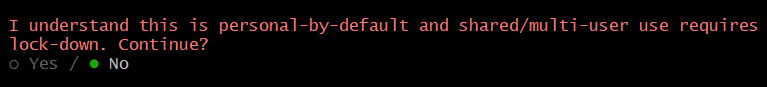

- ¿Inicio rápido o manual?  
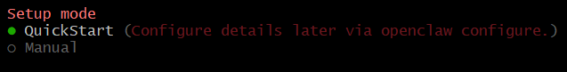

- ¿Gateway local o en la nube?  
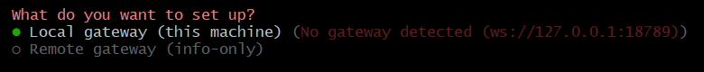

- Directorio de trabajo del agente (workspace)  
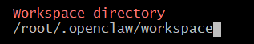

- Configurar el OAuth para el modelo de lenguaje (en este caso, OpenAI Codex)  
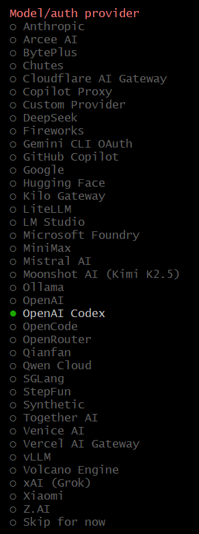

- Abrir esa URL y copiar la URL que genera el proceso de autenticación (en este caso, para OpenAI Codex)  
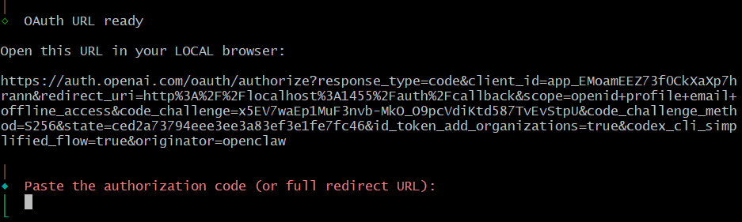

- Modelo que se va a usar por defecto para los agentes (en este caso, OpenAI Codex GPT-5.4)  
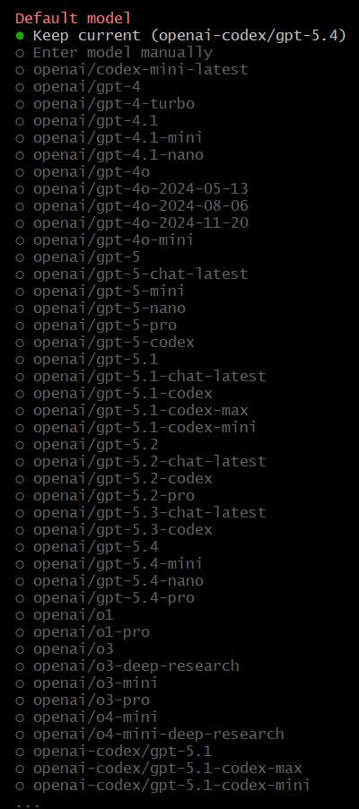

- Puerto para el Gateway (18791 por defecto)  
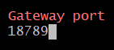

- IP de enlace para el Gateway (loopback por defecto, lo que significa que solo será accesible desde la máquina local)  
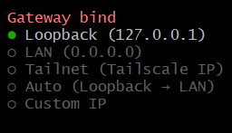

- Autenticación para el Gateway (token por defecto, lo que significa que se generará un token de autenticación que se usará para acceder al Gateway)  
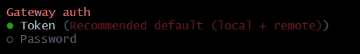

- Tailscale para el acceso remoto al Gateway (desactivado por defecto, lo que significa que el Gateway no estará accesible a través de Tailscale)  
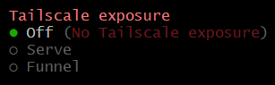

- ¿Quieres proveer el token de autenticación ahora o dejar que se genere automáticamente? (generar automáticamente por defecto)  
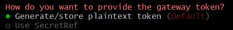

- Token en blanco para que se genere automáticamente  
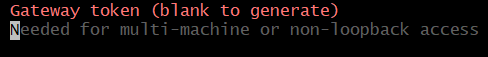

- ¿Configurar canales de chat? (no por defecto, lo que significa que los canales de comunicación se pueden configurar más tarde. Decimos que sí para configurar Telegram)  
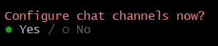

- Selecciona un canal de chat para configurar (en este caso, Telegram)  
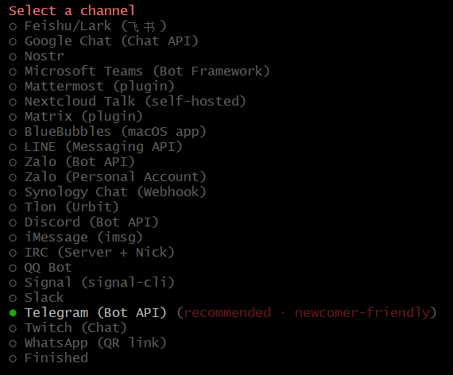

- Introducir el token del bot de Telegram  
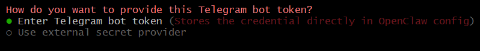

- Configurar gestion de dispositivos (Device Managment). Por defecto se empareja
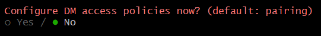

---
<br>

## 2. Comandos básicos 💻
```bash
acp *          # Agent Control Protocol tools
agent          # Run one agent turn via the Gateway
agents *       # Manage isolated agents (workspaces, auth, routing)
approvals *    # Manage exec approvals (gateway or node host)
backup *       # Create and verify local backup archives for OpenClaw state
capability *   # Run provider-backed inference commands (fallback alias: infer)
channels *     # Manage connected chat channels (Telegram, Discord, etc.)
clawbot *      # Legacy clawbot command aliases
completion     # Generate shell completion script
config *       # Non-interactive config helpers (get/set/unset/file/validate). Default: starts guided setup.
configure      # Interactive configuration for credentials, channels, gateway, and agent defaults
cron *         # Manage cron jobs via the Gateway scheduler
daemon *       # Gateway service (legacy alias)
dashboard      # Open the Control UI with your current token
devices *      # Device pairing + token management
directory *    # Lookup contact and group IDs (self, peers, groups) for supported chat channels
dns *          # DNS helpers for wide-area discovery (Tailscale + CoreDNS)
docs           # Search the live OpenClaw docs
doctor         # Health checks + quick fixes for the gateway and channels
exec-policy *  # Show or synchronize requested exec policy with host approvals
gateway *      # Run, inspect, and query the WebSocket Gateway
health         # Fetch health from the running gateway
help           # Display help for command
hooks *        # Manage internal agent hooks
infer *        # Run provider-backed inference commands
logs           # Tail gateway file logs via RPC
mcp *          # Manage OpenClaw MCP config and channel bridge
memory         # Search, inspect, and reindex memory files
message *      # Send, read, and manage messages
models *       # Discover, scan, and configure models
node *         # Run and manage the headless node host service
nodes *        # Manage gateway-owned node pairing and node commands
onboard        # Interactive onboarding for gateway, workspace, and skills
pairing *      # Secure DM pairing (approve inbound requests)
plugins *      # Manage OpenClaw plugins and extensions
proxy *        # Run the OpenClaw debug proxy and inspect captured traffic
qa *           # Run QA scenarios and launch the private QA debugger UI
qr             # Generate mobile pairing QR/setup code
reset          # Reset local config/state (keeps the CLI installed)
sandbox *      # Manage sandbox containers for agent isolation
secrets *      # Secrets runtime reload controls
security *     # Security tools and local config audits
sessions *     # List stored conversation sessions
setup          # Initialize local config and agent workspace
skills *       # List and inspect available skills
status         # Show channel health and recent session recipients
system *       # System events, heartbeat, and presence
tasks *        # Inspect durable background task state
tui            # Open a terminal UI connected to the Gateway
uninstall      # Uninstall the gateway service + local data (CLI remains)
update *       # Update OpenClaw and inspect update channel status
webhooks *     # Webhook helpers and integrations
```
---
<br>

## 3. Archivo de configuración 🛠️
El archivo `openclaw.json` tiene las siguientes secciones principales:
- `agents`: Configuración relacionada con los agentes, incluyendo el espacio de trabajo y los modelos utilizados.
- `gateway`: Configuración del gateway, incluyendo el modo de operación, autenticación, puerto, y opciones de Tailscale.
- `meta`: Información meta sobre la última versión tocada y la última vez que se tocó el archivo de configuración.
- `wizard`: Información sobre la última ejecución del asistente de configuración.
- `auth`: Perfiles de autenticación para diferentes proveedores.
- `plugins`: Configuración de los plugins habilitados.
- `models`: Configuración de los modelos de lenguaje utilizados por los agentes.
- `messages`: Configuración relacionada con el manejo de mensajes.
- `commands`: Configuración de comandos personalizados para los agentes.
- `hooks`: Configuración de hooks para ejecutar código personalizado en ciertos eventos.
- `channels`: Configuración de los canales de comunicación, como Telegram.
- `skills`: Configuración de habilidades específicas para los agentes.
- `browser`: Configuración relacionada con la funcionalidad de navegación web de los agentes.
```json
$ cat openclaw.json
{
  "agents": {
    "defaults": {
      "workspace": "/root/.openclaw/workspace",
      "models": {
        "openai-codex/gpt-5.4": {}
      },
      "model": {
        "primary": "openai-codex/gpt-5.4"
      }
    }
  },
  "gateway": {
    "mode": "local",
    "auth": {
      "mode": "token",
      "token": "${GATEWAY_TOKEN}"
    },
    "port": 18789,
    "bind": "loopback",
    "tailscale": {
      "mode": "off",
      "resetOnExit": false
    },
    "nodes": {
      "denyCommands": [
        "camera.snap",
        "camera.clip",
        "screen.record",
        "contacts.add",
        "calendar.add",
        "reminders.add",
        "sms.send",
        "sms.search"
      ]
    }
  },
  "session": {
    "dmScope": "per-channel-peer"
  },
  "tools": {
    "profile": "coding"
  },
  "auth": {
    "profiles": {
      "openai-codex:richy_ai@hotmail.com": {
        "provider": "openai-codex",
        "mode": "oauth",
        "email": "richy_ai@hotmail.com"
      }
    }
  },
  "channels": {
    "telegram": {
      "enabled": true,
      "groups": {
        "*": {
          "requireMention": true
        }
      },
      "botToken": "${TELEGRAM_BOT_TOKEN}"
    }
  },
  "wizard": {
    "lastRunAt": "2026-04-19T19:36:00.755Z",
    "lastRunVersion": "2026.4.15",
    "lastRunCommand": "onboard",
    "lastRunMode": "local"
  },
  "meta": {
    "lastTouchedVersion": "2026.4.15",
    "lastTouchedAt": "2026-04-19T19:36:13.995Z"
  },
  "plugins": {
    "entries": {
      "openai": {
        "enabled": true
      }
    }
  }
}
```
---
<br><br><br>

## *[volver al índice](../README.md)*